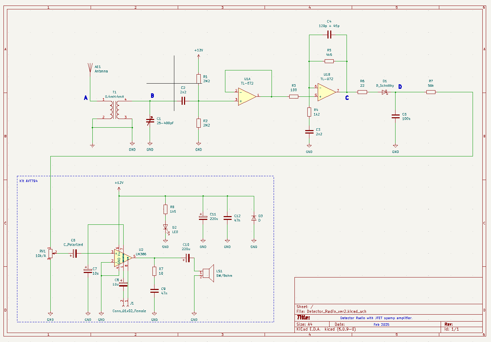

 

# Regenerative_Radio_Receiver

This project started as part of investigation of how to receive very long frequencies especially SAQ signal
emited from Grimeton, Sweden. I wanted to build very simple receiver with high frequency amplifier. 
Since it is difficult to experiment with such infrequent transmissions, I have first looked at receiving DCF-77 
and then decided to base my desing on Polish Radio 225kHz signal, which is not really VLF, but allowed 
me to test design assumptions. 

## Introduction

I noticed that some SAQ pre-amps and DCF receivers were based on op-amps [2], [4] so I decided to use one in 
my design as well. I selected TL-072 primarly due to its relatively wide bandwith (GBW of about 3MHz) and high input impedance (J-FET). Other factors I considered were: low noise, low price and high availability of this opamp.

I wanted the input LC tank to be decoupled (isolated) from the antenna so antenna reactance has limited impact on resonance frequency of LC tank. I have chosen magnetic coupling between antenna and the LC tank utilizing approximately 1:3 transformer assembled on ferrite rod.

To avoid excessive loading of LC tank by input impedance of high frequency amplifier stage, J-FET based amplifier must be used. For reasons stated above I have selected TL-072 opamp for this purpose, which utilizes pair of J-FET transistor at its input.

Using various loads, I have observed that input impedance of high ferequency amplifier stage shall not be lower then 1Mohm for its impact on LC output voltage in resonance to be limited.

Since the input impedance of none inverting amplifier U1B is only equal to:

$Rinnoneinv = R5 || (R4 +X3) = 2.7kohm$

where reactance X3 for capacitor C3 at f=225kHz is equal to 300ohm.

I have decided to use voltage follower U1A to buffer LC tank.

It is also critical to understand that TL-072  input voltage must be not be less then 3V to function correctly. This put requirement on input signal DC biasing (resistors R1 and R2). 

Taking into account biasing resistors the input impedance of voltage follower amplifier in this configuration is equal to:

$Rin = R1 || R2 || Rinopamp$

which in practice is euqal to: 

$Rin = R1 || R2$ 

since $R1 || R2 << Rinopamp$

In order to keep input impedance on high level R1 and R2 were set to 2.2Mohm, which set input impadance of amplifier stage to about 1.1Mohm.

Since the voltage follower U1A has amplification gain factor of 1, the overall hf amplification is set by U1B loop resistor R5 and gain-setting resistor R4 in series with C3 reactance of X3. 

U1B is configured as none inverting amplifier, which means its voltage amplification gain factor for f=225kHz can be expressed as:

$k = 1 + R5 / (R4 + X3) = 1 + 4600 / (1200 +300) = 4.1$

Capacitor C3 is added in order to avoid amplifying DC biasing voltage of Vcc/2=6V by U1B.

R3, R6 and C4 were added to stabilize the circuit. Without those components, amplifier was saturating from time to time and the only way to put it back into operation was power off...

To limit high frequency noise I have connected antenna ground with the ground of the circuit.

Finally, the resonance frequency of LC tank can be calculated as:

$$fres = 1/2pi\sqrt{Lt1sec*C1}$$

## Design Description

Radio's circuit diagram:

 

## Measurement Results

##  References

[1] Proste Odbiorniki Amatorskie, Tom 1, Krszysztof Dąbrowski, OE1KDA
[2] Listen to SAQ, https://alexander.n.se/en/the-radio-station-saq-grimeton/lyssna-pa-saq/
[3] SAQ or how to receive very long frequencies, https://prinz.nl/SAQ.html
[4] Software Defined DCF77 Receiver, Filip Zaplata, Miroslav Kasal, Brno University of Technology
[5] TL072 Low Noise J-FET Dual Operational Amplifiers Datasheet, ST Electronics